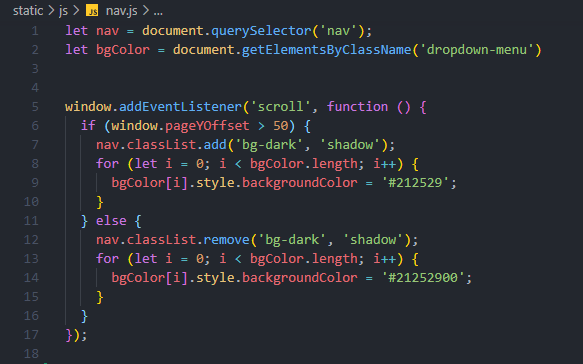
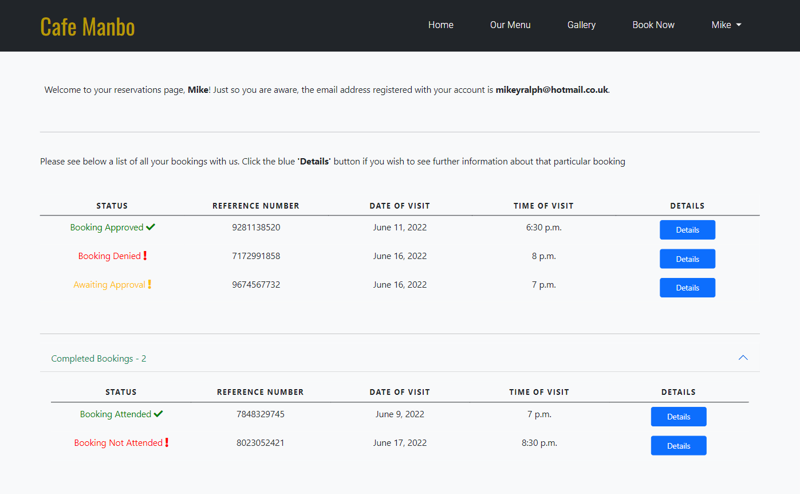
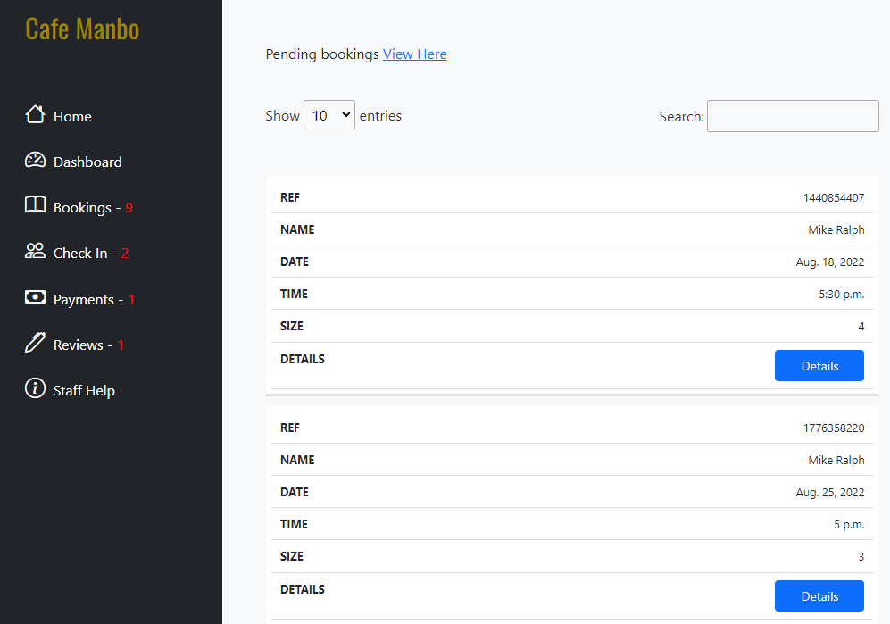
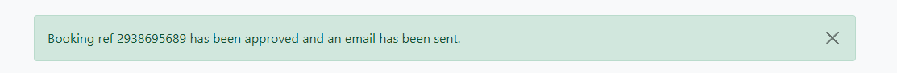
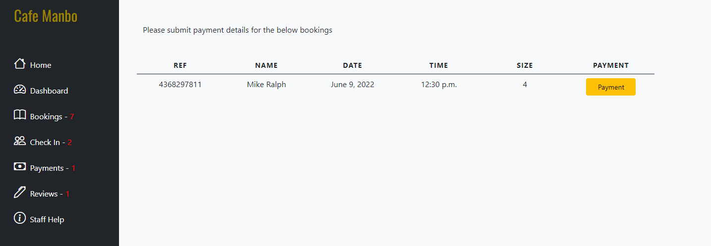
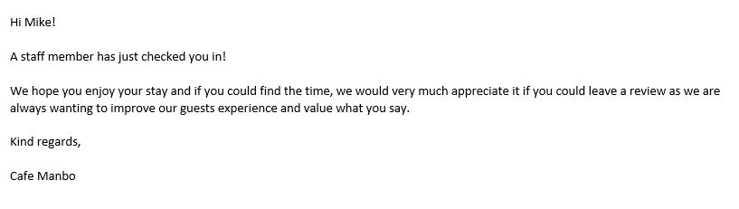
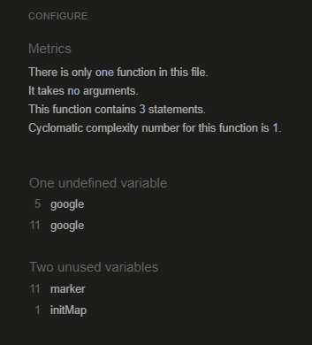
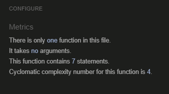
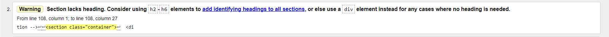

# **_Cafe Manbo - Project Portfolio 4 - Full Stack_**

Cafe Manbo is a family restaurant located in England, Wakefield. Guests are able to visit restaurant after they have placed a booking via the website. The website itself has been designed with a "real world application" in mind, therefore the website has been designed in two parts. First, users will see a visually appealing front-end website which shows users information about the restaurant, allows users to create an account, make a booking, write a review, contact the restaurant and more. The other half of the website acts as a management system for staff members that work at Cafe Manbo. If an account has the correct permissions, the staff member will be able to see a staff dashboard which will allow them to manage everything related to Cafe Manbo such as bookings, reviews, payments and also see informative statistical data about the restaurant.

You can view the live site here - <a href="https://cafe-manbo.herokuapp.com/" target="_blank" rel="noopener">Cafe Manbo</a>


# Contents

* [**Objective**](<#objective>)
* [**User Experience UX**](<#user-experience-ux>)
    * [User Stories](<#user-stories>)
    * [Design Prototype](<#design-prototype>)
    * [Site Structure](<#site-structure>)
    * [Design Choices](<#design-choices>)
    *  [Typography](<#typography>)
    *  [Colour Scheme](<#colour-scheme>)
    * [Project Management](<#project-management>)
* [**Existing Features (Site User)**](<#existing-features-for-site-user>)
    * [Site Navigation Bar](<#site-responsive-navigation-bar>)
    * [Dynamic Reviews](<#dynamic-reviews>)
    * [Hours & Location](<#hours-and-location>)
    * [Footer](<#footer>)
    * [Our Menu](<#our-menu>)
    * [Gallery](<#gallery>)
    * [Book Now](<#book-now>)
    * [My Reservations](<#my-reservations>)
    * [Account Creation](<#account-creation>)
    * [Write A Review](<#write-a-review>)
    * [404 & 500 Pages](<#404-and-500-error-pages>)
* [**Existing Existing Features (Staff Member)**](<#existing-features-for-staff-member>)
    * [Staff Dashboard](<#staff-dashboard>)
    * [Staff Navigation Bar](<#staff-responsive-navigation-bar>)
    * [Bookings](<#bookings>)
    * [Check In](<#check-in>)
    * [Payments](<#payments>)
    * [Reviews](<#reviews>)
    * [Staff Help](<#staff-help>)
    * [Automatic Emails](<#automatic-email-sending>)
* [**Future Features**](<#future-features>)
    * [Improved Booking System](<#improved-booking-system>)
    * [Contact/Enquiry](<#contactenquiry>)
    * [Dedicated User Profile Page](<#dedicated-user-profile-page>)
* [**Technologies Used**](<#technologies-used>)
* [**Python Packages**](<#python-packages>)
* [**Testing**](<#testing>)
* [**Deployment To Heroku**](<#deployment-to-heroku>)
* [**Credits**](<#credits>)
    * [**Content**](<#content>)
    * [**Media**](<#media>)
*  [**Acknowledgments**](<#acknowledgements>)
*  [**Personal Development**](<#personal-development>)


# Objective

For my fourth project, I intend to create an authentic, practical and useful restaurant website which could potentially be used in a real world environment. The main objective is to demonstrate a strong level of competency in HTML, CSS, JavaScript, Python and the Django Framework alongside showcasing high attention to detail and the importance of robust testing throughout.

[Back to top](<#contents>)

# User Experience (UX)

## User Stories

### Site User

|  | | |
|:-------:|:--------|:--------|
| As a Site User | I can book online to come visit the restaurant | &check; |
| As a Site User | I can view all my bookings in one place | &check; |
| As a Site User | I can amend and cancel my booking | &check; |
| As a Site User | I can create a review about my visit to Cafe Manbo | &check; |
| As a Site User | I can view the menu | &check; |
| As a Site User | I can view images relating to Cafe Manbo | &check; |
| As a Site User | I can see reviews from other guests | &check; |

### Site Staff Member

|  | | |
|:-------:|:--------|:--------|
| As a Site Staff Member | I can approve, deny and amend bookings | &check; |
| As a Site Staff Member | I can approve and deny submitted reviews | &check; |
| As a Site Staff Member | I can check guests in or no show guests if they don't turn up | &check; |
| As a Site Staff Member | I can submit payment information about a completed booking | &check; |
| As a Site Staff Member | I can view a Staff Dashboard to view statistical data about Cafe Manbo | &check; |


## Design Prototype

The very first design prototype was created using [Balsamiq](https://balsamiq.com/). Descriptive text<br /><br />


[Back to top](<#contents>)

## Site Structure

As mentioned above, the website for Cafe Manbo has been designed to be a fully encompassing website that acts as a central hub for both users and staff members.

* Main Website
    * Home, Our Menu, Gallery, Book Now, My Reservations and Write A Review.
    * Visually appealing, minimalistic and welcoming design.
    * Simple, easy and fast booking with strong form validation.
    * All bookings are easily manageable for the user in the 'My Reservations' page.

* Staff Dashboard
    * Home, Dashboard, Bookings, Check In, Payments, Reviews, Staff Help.
    * A separate, detached part of the website theme for staff members to manage everything at Cafe Manbo.
    * Informative dashboard panel which showcases a vast range of statistical data about Cafe Manbo.
    * A simple and logical booking flow system.
    * A staff help modal to aid staff members.

## Design Choices

 * ### Typography
      The fonts chosen were 'Oswald' for the golden headings and I decided to use the standard 'sans-serif' for the body text however different font-weights and font-sizes were used to give further clarity. All fonts fall back to sans-serif respectively if the 'Oswald' font can't be loaded.

    * 'Oswald' was chosen primarily to give a touch of style and elegance to the website. The font-style is very     modern, stylish, clean and gives a professional and inviting feeling to the website.

 * ### Colour Scheme
      The colour scheme chosen is one based on a rich gold, eerie-black and off-white. This colour scheme gives off a warm, clean, minimalistic and positive feeling to the website.<br /><br />


## Project Management

 * ### Trello
      I used an excellent application called [Trello](https://trello.com/en-GB) which greatly improved organisation and productivity. This tool allows the individual to properly plan and create a systematic work flow so you are always aware of what needs to be done next.

      I would first create a very basic overview of what I wanted to achieve and then break it down into smaller more manageable steps. Before finishing for the day, I would spend at least 15 minutes planning for the next day so that when I came back to developing I could open my Trello board and instantly get back developing since I would know immediately what I need to be working on. I highly recommend this tool to any developer or development team. <br /><br />


 * ### GitHub Project Board
      Additionally to Trello, I utilised the GitHub project management tool to breakdown, organise and plan my user stories. I decided to do this to give me further experience when working within an Agile environment. Although this project was built entirely by myself, I can fully appreciate and understand the importance of using a tool like this as each ticket has the ability to have multiple users assigned, comments can be made, labels can be added and so much more. <br /><br />


## Database 

* ### Database Schema
    To create the database schema, I used an excellent graph modelling tool [Graph Models](https://django-extensions.readthedocs.io/en/latest/graph_models.html) which shows the entire relationship between all models in the database. After following the steps required to install Graph Models, I then used [dreampuf](https://dreampuf.github.io/GraphvizOnline/) to present the data in a clear and professional way. <br /><br />


* ### Table Plus
    To aid myself when needing to work with the database, I downloaded an external program called [TablePlus](https://tableplus.com/) which allows me to access and manipulate the project databases very easily and quickly. This vastly increased development time as I could change the values in the database and see the effect that it would have on the website.


## Existing Features For Site User

  * ### Site Responsive Navigation Bar

      * The navigation bar is an extremely important and integral part of any website so I decided to spend a lot of time trying to make one that is very user friendly that would promote a positive emotional response for the user.
      * Using a mixture of both CSS, JavaScript and Bootstrap, I've created a dynamic, responsive and animated navigation bar.
      * Upon initial visit, the entire navigation bar will be transparent but upon scrolling 50px, the navigation bar will then apply a dark background. The dark background will also be applied when the navigation bar becomes responsive.
      * I decided to create 2 navigation bars for the main website. navbar.html is the home page navbar which is transparent at first then transitions to dark after 50px and navbar_2.html is a non-transparent navbar which is used for all subsequent pages
      * If a user has not logged in then the navigation bar will show the 'Account' option. After they have signed in, it will then display their username. To mitigate any responsive design issues, I have decided to slice the first 10 characters of their name and display that to the user.
      * When the navigation bar hits the breakpoint, it will then collapse into a hamburger which I have made animate into a red cross when clicked.  <br /><br />

<details><summary><b>Transparent Navigation Bar</b></summary>


</details><br />

<details><summary><b>Navigation Bar Transition 50px</b></summary>


</details><br />

<details><summary><b>Navigation Bar Transition Code</b></summary>


</details><br />

<details><summary><b>Navigation Bar Responsive Image</b></summary>


</details><br />

<details><summary><b>Navigation Bar Responsive Dropdown Image</b></summary>


</details><br />

  * ### Dynamic Reviews 

      * Reviews from other guests can be the deciding factor when it comes to new guests deciding whether to dine at the restaurant, therefore I had decided that being able to display dynamic reviews to the user was important and worth the development time.
      * 4 Reviews will be displayed at random given that they have been approved and verified by a member of staff.
      * Each review is housed in it's own card, showing the guests name, the star rating the guest selected, the first 80 characters (including spaces) of their review and then a Read More button.
      * Clicking the Read More button will trigger a modal that will show the user the full review <br /><br />

<details><summary><b>Review Cards Image</b></summary>


</details><br />

<details><summary><b>Review Modal Image</b></summary>


</details><br />

  * ### Hours and Location

      * Informing the user where the restaurant is located is extremely important, therefore I decided to have clean, decisive information regarding the whereabouts of Cafe Manbo.
      * Integrated Google Maps so the user can visually see the location.
      * The address, location and phone number used are completely made up for security purposes.
      <br /><br />

<details><summary><b>Hours and Location Image</b></summary>


</details><br />

  * ### Footer

      * A simplistic yet elegant design, used to naturally end the page and provide the user with some quick links so they can navigate the website faster if they wish to. <br /><br />

<details><summary><b>Footer Image</b></summary>


</details><br />

<details><summary><b>Footer Responsive Image</b></summary>


</details><br />

  * ### Our Menu

      * I decided that it was a lot more practical and also I think professional to design the menu on an external PDF and then host that for the user to view. 
      * The menu was designed using [Canva](https://www.canva.com/) and then hosted on [Cloudinary](https://cloudinary.com/) <br /><br />

<details><summary><b>Menu Image 1</b></summary>


</details><br />

<details><summary><b>Menu Image 2</b></summary>


</details><br />

<details><summary><b>Menu Image 3</b></summary>


</details><br />

  * ### Gallery

      * The gallery page is used as way to showcase images of the restaurant to users. As the saying goes, a picture paints a thousand words and being able to show appealing images will greatly increase the chances of guests visiting Cafe Manbo. <br /><br />

<details><summary><b>Gallery Image</b></summary>


</details><br />

  * ### Book Now

      * The book now page will only be accessible if the user has logged in with an account. If they have not logged in and they click the Book Now link, they will be redirected to the log in page
      * I have spent a lot of development time working on form validation since Cafe Manbo is a restaurant website, each booking needs to be unique and fully validated before a staff member needs to spend time processing it.
      * Alongside the standard input field validation, I have also added some additional validation which checks if the user is booking in the past. For example, if the time is 19:00 and they are trying to book for 17:00, then it will throw an error informing the user that they can't book in the past. The same goes for the date, if they try book for a date that isn't either today or in the year 2022, it will inform the user accordingly.
      * Additionally I have accounted for double bookings. When the user submits the form, I then collect all that data, check if the database holds a booking with very similar data and if so, inform the user that the booking was unsuccessful because we appear to already have this booking in the database. <br /><br />

<details><summary><b>Book Now Image</b></summary>


</details><br />

<details><summary><b>Book Now Responsive Image</b></summary>


</details><br />

<details><summary><b>Book Now Success Image</b></summary>


</details><br />

<details><summary><b>Book Now Duplicate Image</b></summary>


</details><br />

<details><summary><b>Date Of Visit Custom Validation</b></summary>


</details><br />

<details><summary><b>Time Of Visit Custom Validation</b></summary>


</details><br />

  * ### My Reservations

      * The My Reservations page was created so that a user can manage all of their bookings in one distinct place.
      * If a user does not have any bookings stored in the database, then they will be prompted with a "no bookings found" page.
      * Each booking is displayed individually for the user with some informative data about that booking and also a blue Details button which will load even further information about that users booking.
      * I decided that a user would have only a few pending bookings, however if a customer really enjoys Cafe Manbo then they could potentially have multiple completed bookings and therefore I decided to place all completed bookings within a collapsible bootstrap accordion to help with the page space and presentation
      * There are currently 5 different states that a users booking can be in. They are the following: <br /><br />
        * <strong>Awaiting Approval</strong> - <i>Booking has been submitted, awaiting staff members approval</i>
        * <strong>Booking Approved</strong> - <i>Staff member has approved the booking but the guest has not yet attended</i>
        * <strong>Booking Attended</strong>- <i>Booking has been approved and the guest has attended</i>
        * <strong>Booking Denied</strong> - <i>Booking has been submitted but a staff member denied the booking</i>
        * <strong>Booking Not Attended</strong> - <i> Staff member has approved the booking but the guest did not attend </i> <br /><br />
      * If a user clicks the blue details booking to load the additional information about their booking, if the booking has not been completed then they will have the option to Edit or Cancel the booking. Clicking the edit booking will launch a modal that will allow the user to submit new information for that booking. If it passes the form validation requirements then the booking state will be set back to "Awaiting Approval" and a staff member will need to approve this booking.
      * Alternatively if they click cancel booking, a separate modal will pop up and prompt the user asking them if they wish to cancel this booking. Doing so will completely delete this booking from the database.<br /><br />
    

<details><summary><b>No Bookings Found Image</b></summary>


</details><br />

<details><summary><b>My Reservations All States Image</b></summary>


</details><br />

<details><summary><b>My Reservations Details Image</b></summary>


</details><br />

<details><summary><b>My Reservations Edit Booking Image</b></summary>


</details><br />

<details><summary><b>My Reservations Cancel Booking Image</b></summary>


</details><br />

  * ### Account Creation

      * To enable users to be able to create an account on the website, I used a brilliant package called [Django AllAuth](https://django-allauth.readthedocs.io/en/latest/installation.html) and then customised the html pages to fit the theme of the website. <br /><br />

<details><summary><b>Signup Image</b></summary>


</details><br />

<details><summary><b>Login Image</b></summary>


</details><br />

<details><summary><b>Password Reset Image</b></summary>


</details><br />

  * ### Write A Review

      * If a user has logged in, they are able to submit a review for the restaurant.
      * This review then has to be approved by a member of staff before it gets rendered on the home page for other users to view.
      * Standard form validation applies to all fields with the additional form validation on the body field asking the user to submit a review that is at least 80 characters long. This is done for two reasons, firstly it helps with the presentation of the preview cards and secondly, it can can prevent users submitting very small reviews that don't give a very insightful look at what it's like to dine at Cafe Manbo.
      * When a user has successfully submitted a review, they will be presented with a thank you page, thanking the user for their review and also provide them with a preview of how their review will look like on the home page if their review is approved by a member of staff. <br /><br />

<details><summary><b>Write A Review Image</b></summary>


</details><br />

<details><summary><b>Review Submitted Image</b></summary>


</details><br />

  * ### 404 and 500 Error Pages

      * If a user navigates to a page that does not exist, they will be presented with a custom 404 error page
      * If a user navigates to a page and they encounter an issue which is server side related, they will be presented with a custom 500 error page <br /><br />

<details><summary><b>404 Error Page Image</b></summary>


</details><br />

<details><summary><b>500 Error Page Image</b></summary>


</details><br />


## Existing Features For Staff Member

  * ### Staff Dashboard

      * The staff dashboard was created to give staff members a visually appealing but more importantly, an insightful way of viewing statistical data about Cafe Manbo.
      * 4 bootstrap cards are located at the top of the page giving information about Total Bookings, Total Guests, Total Reviews and Total Income. All this data is completely dynamic and is gathered from the database.
      * I have used a brilliant piece of third-party software from [ChartJS](https://www.chartjs.org/) which allows me to display data in a visually appealing way such as a bar or pie chart. Using this software I am able to immediately display to staff members how many bookings and how many guests have attended given a 12 month period.
      * To complete the staff dashboard, I have created a 'Quick Statistics' section which gives additional fast and basic information about Cafe Manbo. All the data is completely dynamic <br /><br />

<details><summary><b>Staff Dashboard Image</b></summary>


</details><br />

<details><summary><b>Staff Dashboard Cards Image</b></summary>


</details><br />

<details><summary><b>Staff Dashboard Bar Chart Image</b></summary>


</details><br />

<details><summary><b>Staff Dashboard Pie Chart Image</b></summary>


</details><br />

<details><summary><b>Staff Dashboard Quick Statistics Image</b></summary>


</details><br />

  * ### Staff Responsive Navigation Bar

      * The navigation bar for the staff dashboard is positioned on the left hand side to give an administrative feel to this part of the website.
      * 7 available links for a staff member to click. Home, Dashboard, Bookings, Check In, Payments, Reviews and Staff Help <br /><br />
        * <strong>Home</strong> - <i>Returns the staff member back to the home page of the main website</i>
        * <strong>Dashboard</strong> - <i>Loads the staff dashboard page</i>
        * <strong>Bookings</strong> - <i>Loads the bookings page</i>
        * <strong>Check In</strong> - <i>Loads the check in page</i>
        * <strong>Payments</strong> - <i>Loads the payments page</i>
        * <strong>Reviews</strong> - <i>Loads the reviews page</i>
        * <strong>Staff Help</strong> - <i>Loads a modal to aid staff members</i><br /><br />
    
    * Bookings, Check In, Payments and Reviews have a red notification number that will be rendered to the side of the link if there is any form of information that is required for a staff member to deal with. For example, if there is a new booking that has come in from a guest, the Booking link will show a (1) next to it informing the staff member that there is a booking that requires attention.<br /><br />

<details><summary><b>Staff Navigation Bar Image</b></summary>


</details><br />

<details><summary><b>Staff Navigation Bar Responsive Image</b></summary>


</details><br />

  * ### Bookings

      * This is the first part of the booking flow system. When a guest makes a booking, it will then be displayed here for a staff member to either approve or deny. When a staff member has approved or denied a booking, it will be removed from this page and a flash message will appear giving the staff member additional feedback that their action has been submitted
      * A staff member can click the "All bookings View Here" which will render a new page which utilises [DataTables](https://datatables.net/). I've decided to use Data Tables to help with presentation and aid staff members in locating specific bookings. If and when the restaurant has hundreds, even thousands of bookings, a staff member can use the search feature to quickly identify and navigate to that booking.
      * I have integrated automatic email sending which will send an email to the users booking email informing them that their booking has either been approved or denied. <br /><br />

<details><summary><b>Staff Bookings Image</b></summary>


</details><br />

<details><summary><b>Staff Bookings Responsive Image</b></summary>


</details><br />

<details><summary><b>Staff All Bookings Image</b></summary>


</details><br />

<details><summary><b>Staff All Bookings Responsive Image</b></summary>


</details><br />

<details><summary><b>Staff Details Booking Image</b></summary>


</details><br />

<details><summary><b>Staff Bookings Approved Flash Image</b></summary>


</details><br />

<details><summary><b>Staff Bookings Denied Flash Image</b></summary>


</details><br />

  * ### Check In

      * This is the second part of the booking flow system. After a staff member has approved a booking, the booking will then be displayed here if the booking in question is on todays date. For example if a booking is made and approved for 15/05/2022, that booking will only be displayed on the check in page on 15/05/2022. This is done to aid staff members when it comes to checking guests in.
      * If a staff member checks a guest in, the booking will then be removed from the check in page and then it will be sent to the third and final stage of the booking flow system which is the payments page.
      * If a staff member marks a guest as no show then the booking will not be sent to the payments stage.
      * Additionally, if a staff member is too busy and doesn't "no-show" a guest because they didn't turn up, the following day when the staff member clicks the 'Check In' link on the navigation bar, the system will send an automatic email out to the guest informing them that they did not show up.
      * An email will be sent out to the guest for both 'Check In' and 'No Show'. This is sent out for security measures.<br /><br />

<details><summary><b>Staff Check In Image</b></summary>


</details><br />

<details><summary><b>Staff Check In Responsive Image</b></summary>


</details><br />

  * ### Payments

      * This is the third and final part of the booking flow system. After a staff member has checked the booking in, the booking will then be displayed here.
      * When the staff member clicks the yellow Payment button, it will then render a new page which will display additional information about that booking along with 2 input fields where a staff member can submit payment information.
      * To prevent staff members submitting payments that have not been settled, I have included some simple form validation that will check if the amount paid is equal or more than the amount owed. 
      * When a staff member has successfully submitted payment details for that booking, the payment form will be removed and the details page will be updated.
      * This is then the end of the booking flow system however a staff member will still be able to access this booking through the Bookings > All Bookings page <br /><br />

<details><summary><b>Staff Payment Image</b></summary>


</details><br />

<details><summary><b>Staff Payment Responsive Image</b></summary>


</details><br />

<details><summary><b>Staff Payment Details Image</b></summary>


</details><br />

<details><summary><b>Staff Payment Details Submitted Image</b></summary>


</details><br />

<details><summary><b>Staff Payment Validation Image</b></summary>


</details><br />

  * ### Reviews

      * This is the section which will present all reviews that have been submitted by guests. 
      * Upon clicking the Reviews link on the navigation bar, the reviews that have not yet been actioned by a staff member will be presented here. At the top of the page is a link that will take the staff member to a page that will render all reviews. Here they can reset a review which will send it back to pending so they can either re-approve or re-deny the review.<br /><br />

<details><summary><b>Staff Reviews Image</b></summary>


</details><br />

<details><summary><b>Staff All Reviews Image</b></summary>


</details><br />

  * ### Staff Help

      * This is a simple link that will pop a modal up which is aimed to help and aid the staff member when navigating the staff dashboard.<br /><br />

<details><summary><b>Staff Help Booking Modal Image</b></summary>


</details><br />

<details><summary><b>Staff Help Check In Modal Image</b></summary>


</details><br />

<details><summary><b>Staff Help Payment Modal Image</b></summary>


</details><br />

<details><summary><b>Staff Help Review Modal Image</b></summary>


</details><br />

  * ### Automatic Email Sending

      * I decided that integrating automatic email sending to users would be beneficial as it acts as a further form of confirmation for the user about the status of their booking.
      * I originally used [GMail](https://en.wikipedia.org/wiki/Gmail) as the email provider to send the emails however I encountered multiple '500 server errors'. These errors would be caused due to Google having a security measure that would prevent "less secure apps" from accessing the google account. There was an option that was available which allowed users to "Allow less secure apps" but this was removed May 30th 2022. Since then, I had looked into multiple different Email providers and after much configuration and consideration, I found that using [Outlook](https://en.wikipedia.org/wiki/Microsoft_Outlook) was best suited for my current requirements.  <br /><br />

<details><summary><b>Outlook Approved Image</b></summary>


</details><br />

<details><summary><b>Outlook Approved Template</b></summary>


</details><br />

<details><summary><b>Outlook Denied Image</b></summary>


</details><br />

<details><summary><b>Outlook Denied Template</b></summary>


</details><br />

<details><summary><b>Outlook Checked In Image</b></summary>


</details><br />

<details><summary><b>Outlook Checked In Template</b></summary>


</details><br />

<details><summary><b>Outlook No Show Image</b></summary>


</details><br />

<details><summary><b>Outlook No Show Template</b></summary>


</details><br />

<details><summary><b>Email Code Image</b></summary>


</details><br />

<details><summary><b>Email Code Settings Image</b></summary>


</details><br />


[Back to top](<#contents>)


* ## Future Features 

* ### Improved Booking System

    * The booking system does have good form validation and also a way that prevents double bookings, however I do believe that I could improve the system to perform more advanced criteria checking. For example, if a user books for 17:00 on 05/05/2022, they will not be able to book again for 17:00 on 05/02/2022 however they would be able to book again for a different time on that same day given it is a time in the future.

* ### Contact/Enquiry

    * Although guests can contact the restaurant via phone or email, I think it would make for a better user experience if a user could fill in a contact or enquiry form. This could work in tandem with the other future feature 'Dedicated User Profile Page' and any enquiries or replies could be sent there for the guest to see.

* ### Dedicated User Profile Page

    * At the moment when a guest creates an account, all the functionality needed for the guest to operate the website, make bookings, see details is there however I would like to make a dedicate profile page which would give the ability for users to do the following

        * Change profile details
        * View profile details
        * View reservations
        * View submitted reviews
        * View data about the guest in relation to Cafe Manbo
        * Message centre for the guest to communicate with staff members

# Technologies Used
* [Django](https://www.djangoproject.com/) - A model-view-template framework used to create Cafe Manbo
* [Bootstrap](https://getbootstrap.com/) - A CSS framework used to aid in front-end development 
* [HTML5](https://en.wikipedia.org/wiki/HTML) - Provides the content and structure for the website.
* [CSS3](https://en.wikipedia.org/wiki/CSS) - Provides the styling for the website.
* [JavaScript](https://en.wikipedia.org/wiki/JavaScript) - Provides interactive elements of the website
* [Python](https://en.wikipedia.org/wiki/Python_(programming_language)) - Provides the functionality of the website.
* [a11y](https://color.a11y.com/Contrast/) - Used to test the contrast and accessibility.
* [Favicon](https://favicon.io/) - Used to create the favicon.
* [Compressor](https://compressor.io/) - Used to compress the images.
* [VSCode](https://code.visualstudio.com/) - Used to create and edit the website.
* [GitHub](https://github.com/) - Used to host and deploy the website.
* [GitBash](https://en.wikipedia.org/wiki/Bash_(Unix_shell)) - Terminal used to push changes to the GitHub repository.
* [removebg](https://www.remove.bg/) - Used to remove background images.
* [Google Chrome DevTools](https://developer.chrome.com/docs/devtools/) - Used to test responsiveness and debug.
* [Responsive Design Checker](https://www.responsivedesignchecker.com/) - Used to test responsiveness.
* [Balsamiq](https://balsamiq.com/) - Used to create the wire-frame.
* [Trello](https://trello.com/en-GB) - Used as a project management tool to organise my work flow.
* [Canva](https://www.canva.com/) - Used to design the menu.
* [Cloudinary](https://cloudinary.com/) - Used to host all static files .
* [ChartJS](https://www.chartjs.org/) - Used to present data in a bar and pie chart.
* [DataTables](https://datatables.net/) - Used to provide extra functionality for All Bookings.
* [TablePlus](https://tableplus.com/) - Used to view databases in a clean, simple way.
* [Heroku](https://dashboard.heroku.com) - Used to deploy the website
* [PEP8 Validation](http://pep8online.com/) - Used to validate Python code
* [HTML Validation](https://validator.w3.org/) - Used to validate HTML code
* [CSS Validation](https://jigsaw.w3.org/css-validator/) - Used to validate CSS code
* [JSHint Validation](https://jshint.com/) - Used to validate JavaScript code
* [Virutal Environment](https://docs.python.org/3/library/venv.html) - Used to create a virtual environment
* [Graph Models](https://django-extensions.readthedocs.io/en/latest/graph_models.html) - Used to generate a .dot file for all apps and models
* [dreampuf](https://dreampuf.github.io/GraphvizOnline/) - Used to present the .dot file in the form of a database diagram
* [Microsoft Paint](https://en.wikipedia.org/wiki/Microsoft_Paint) - Used to add "Food with a smile" to golden menu stand image

# Libraries

All the libraries used for this project are located in the requirements.txt file which has been created in a virtual environment. These libraries have been documented below.

* [asgiref](https://pypi.org/project/asgiref/) - ASGI is a standard for Python asynchronous web apps and servers to communicate with each other.
* [autopep8](https://pypi.org/project/autopep8/) - Automatically formats Python code to conform to the PEP 8 style guide.
* [black](https://pypi.org/project/black/) - Black makes code review faster by producing the smallest diffs possible.
* [certifi](https://pypi.org/project/certifi/) - Certifi provides Mozilla’s carefully curated collection of Root Certificates for validating the trustworthiness of SSL certificates while verifying the identity of TLS hosts.
* [cffi](https://pypi.org/project/cffi/) - Foreign Function Interface for Python calling C code.
* [charset-normalizer](https://pypi.org/project/charset-normalizer/) - A library that helps you read text from an unknown charset encoding.
* [click](https://pypi.org/project/click/) - It aims to make the process of writing command line tools quick
* [cloudinary](https://pypi.org/project/cloudinary/) - Cloudinary is a cloud service that offers a solution to a web application’s entire image management pipeline.
* [colorama](https://pypi.org/project/colorama/) - Makes ANSI escape character sequences
* [coverage](https://pypi.org/project/coverage/) - Used to measure code coverage, typically during test execution.
* [crispy-bootstrap-5](https://pypi.org/project/crispy-bootstrap5/) - Bootstrap5 template pack for django-crispy-forms.
* [cryptography](https://pypi.org/project/cryptography/) - cryptography includes both high level recipes and low level interfaces to common cryptographic algorithms such as symmetric ciphers, message digests, and key derivation functions.
* [defusedxml](https://pypi.org/project/defusedxml/) - Contains several Python-only workarounds and fixes for denial of service and other vulnerabilities in Python's XML libraries.
* [dj3-cloudinary-storage](https://pypi.org/project/dj3-cloudinary-storage/) - Used to facilitate integration with Cloudinary by implementing Django Storage API. 
* [Django](https://pypi.org/project/Django/) - Django is a high-level Python web framework that encourages rapid development and clean, pragmatic design.
* [django-allauth](https://pypi.org/project/django-allauth/) - Integrated set of Django applications addressing authentication, registration, account management as well as 3rd party (social) account authentication.
* [django-crispy-forms](https://pypi.org/project/django-crispy-forms/) - Used to integrate Django DRY forms.
* [django-extensions](https://pypi.org/project/django-extensions/) - Django Extensions is a collection of custom extensions for the Django Framework. 
* [django-phone-field](https://pypi.org/project/django-phone-field/) - Lightweight model and form field for phone numbers in Django.
* [gunicorn](https://pypi.org/project/gunicorn/) - Gunicorn ‘Green Unicorn’ is a Python WSGI HTTP Server for UNIX.
* [idna](https://pypi.org/project/idna/) - Support for the Internationalised Domain Names in Applications (IDNA) protocol.
* [mypy-extensions](https://pypi.org/project/mypy-extensions/) - The “mypy_extensions” module defines experimental extensions to the standard “typing” module that are supported by the mypy typechecker.
* [numpy](https://pypi.org/project/numpy/) - NumPy is the fundamental package for array computing with Python.
* [oauthlib](https://pypi.org/project/oauthlib/) - OAuthLib is a framework which implements the logic of OAuth1 or OAuth2 without assuming a specific HTTP request object or web framework.
* [pandas](https://pypi.org/project/pandas/) - Used to provide fast, flexible, and expressive data structures designed to make working with "relational" or "labeled" data both easy and intuitive.
* [pathspec](https://pypi.org/project/pathspec/) - pathspec is a utility library for pattern matching of file paths.
* [pep8](https://pypi.org/project/pep8/) - pep8 is a tool to check your Python code against some of the style conventions in PEP 8.
* [platformdirs](https://pypi.org/project/platformdirs/) - A small Python module for determining appropriate platform-specific dirs, e.g. a "user data dir".
* [psycopg2](https://pypi.org/project/psycopg2/) - Psycopg is the most popular PostgreSQL database adapter for the Python programming language.
* [pycodestyle](https://pypi.org/project/pycodestyle/) - pycodestyle is a tool to check your Python code against some of the style conventions in PEP 8.
* [pycparser](https://pypi.org/project/pycparser/) - It parses C code into an AST and can serve as a front-end for C compilers or analysis tools.
* [PyJWT](https://pypi.org/project/PyJWT/) - A Python implementation of RFC 7519.
* [python-dateutil](https://pypi.org/project/python-dateutil/) - The dateutil module provides powerful extensions to the standard datetime module
* [python3-openid](https://pypi.org/project/python3-openid/) - OpenID support for modern servers and consumers.
* [pytz](https://pypi.org/project/pytz/) -  This library allows accurate and cross platform timezone calculations using Python 2.4 or higher.
* [requests](https://pypi.org/project/requests/) - Requests is a simple, yet elegant, HTTP library.
* [requests-oauhlib](https://pypi.org/project/requests-oauthlib/) - OAuthlib authentication support for Requests.
* [six](https://pypi.org/project/six/) - Six is a Python 2 and 3 compatibility library. It provides utility functions for smoothing over the differences between the Python versions.
* [sqlparse](https://pypi.org/project/sqlparse/) - sqlparse is a non-validating SQL parser for Python.
* [toml](https://pypi.org/project/sqlparse/) - A non-validating SQL parser.
* [tomli](https://pypi.org/project/tomli/) - Tomli is a Python library for parsing TOML.
* [urllib3](https://pypi.org/project/urllib3/) - HTTP library with thread-safe connection pooling, file post, and more.


[Back to top](<#contents>)


# Testing

* ## Code Validation

    * Cafe Manbo has been validated by using online validation tools [W3C HTML Validator](https://validator.w3.org/), [W3C CSS Validator](https://jigsaw.w3.org/css-validator/), [JSHint JavaScript Validator](https://jshint.com/) and the [PEP8 Online Validator](http://pep8online.com/).

* ### HTML Validation Image

    

* ### CSS Validation Image

    

* ### JSHint map.js Image

    

    * The JavaScript code for map.js was taken from the Code Institute Resume Project which shows students how to integrate google maps on a website.

* ### JSHint nav.js Image

    

* ### PEP8 Validation Image (run.py)

    

* ### PEP8 Validation Image (print.py)

    

* ### PEP8 Validation Image (questions.py)

    

* ## Lighthouse Testing 

    * Furthermore the website has been through the [Chrome Dev Tools](https://developer.chrome.com/docs/devtools/) Lighthouse Testing which tests the website for the following:
        * Performance - How the page performs whilst loading.
        * Accessibility - Is the site accessible for all players and how can it be improved.
        * Best Practices - Site conforms to industry best practices.
        * SEO - Search Engine Optimisation. Is the site optimised for search engine result rankings.

    * The lighthouse tests were conducted in incognito/private windows due to extensions interfering with the results.<br /><br />

* ### Chrome Desktop Lighthouse Result - Home Page

    

* ### Chrome Mobile Lighthouse Result - Home Page

    

    * Performance is at 77 due to Google Maps blocking the main thread for 440ms. I've decided that this is not something that is too severe however if it did become a significant problem then I would disable Google Maps for mobile users.

* ### Chrome Desktop Lighthouse Result - Gallery Page

    

* ### Chrome Mobile Lighthouse Result - Gallery Page

    

* ### Chrome Desktop Lighthouse Result - Book Now Page

    

* ### Chrome Mobile Lighthouse Result - Book Now Page

    

* ### Chrome Desktop Lighthouse Result - My Reservations Page

    

* ### Chrome Mobile Lighthouse Result - My Reservations Page

    

* ### Chrome Desktop Lighthouse Result - Write A Review Page

    

* ### Chrome Mobile Lighthouse Result - Write A Review Page

    

* ### Chrome Desktop Lighthouse Result - Signup Page

    

* ### Chrome Mobile Lighthouse Result - Signup Page

    

* ### Chrome Desktop Lighthouse Result - Login Page

    

* ### Chrome Mobile Lighthouse Result - Login Page

    

* ### Chrome Desktop Lighthouse Result - Logout Page

    

* ### Chrome Mobile Lighthouse Result - Logout Page

    

* ### Chrome Desktop Lighthouse Result - Staff Dashboard - Dashboard Page

    

* ### Chrome Mobile Lighthouse Result - Staff Dashboard - Dashboard Page

    

* ### Chrome Desktop Lighthouse Result - Staff Dashboard - Pending Bookings Page

    

* ### Chrome Mobile Lighthouse Result - Staff Dashboard - Pending Bookings Page

    

* ### Chrome Desktop Lighthouse Result - Staff Dashboard - All Bookings Page

    

* ### Chrome Mobile Lighthouse Result - Staff Dashboard - All Bookings Page

    

* ### Chrome Desktop Lighthouse Result - Staff Dashboard - Check In Page

    

* ### Chrome Mobile Lighthouse Result - Staff Dashboard - Check In Page

    

* ### Chrome Desktop Lighthouse Result - Staff Dashboard - Payment Page

    

* ### Chrome Mobile Lighthouse Result - Staff Dashboard - Payment Page

    

* ### Chrome Desktop Lighthouse Result - Staff Dashboard - Submit Payment Page

    

* ### Chrome Mobile Lighthouse Result - Staff Dashboard - Submit Payment Page

    

* ### Chrome Desktop Lighthouse Result - Staff Dashboard - Pending Reviews Page

    

* ### Chrome Mobile Lighthouse Result - Staff Dashboard - Pending Reviews Page

    

* ### Chrome Desktop Lighthouse Result - Staff Dashboard - All Reviews Page

    

* ### Chrome Mobile Lighthouse Result - Staff Dashboard - All Reviews Page

    


* ## Accessibility Testing
    * I also put the website through [a11y](https://color.a11y.com/Contrast/) to further test the contrast and found no issues. <br /><br />

    

* ## Responsiveness Testing
    * I conducted responsive tests manually with [Google Chrome DevTools](https://developer.chrome.com/docs/devtools/) and [Responsive Design Checker](https://www.responsivedesignchecker.com/).<br /><br />

    


    


* ## Compressing Images
    * All images that are displayed within the website have been compressed with [Compressor](https://compressor.io/) and I managed to save a total of 12.82 MB.<br /><br />

    

    

* ## Automated Testing
    * During this project I have found the benefit of automated testing to be extremely beneficial. Automated testing as highlighted many minor discrepancies that would have been missed had it not been highlighted when conducting automated testing.

    * I currently have 34 individual tests which provide 91% coverage as shown in the below image.

    

    


* ## Manual Testing
In addition to the other tests, I have conducted a manual check list for myself to carry out to make sure that everything is working as intended.


| Status | **Main Website - User Logged Out**
|:-------:|:--------|
| &check; | Clicking the nav logo loads the home page
| &check; | The nav bar is transparent on load and then the background turns dark upon scrolling 50px
| &check; | The nav bar returns back to transparent when the user scrolls back to the top of the page
| &check; | Clicking the Home button on the nav bar loads the home page
| &check; | Clicking the Our Menu button on the nav bar loads the external menu PDF in a new window
| &check; | Clicking the Gallery button on the nav bar loads the gallery page
| &check; | Clicking the Book Now button on the nav bar loads the login page
| &check; | Clicking the Account button on the nav bar shows the Register and Login dropdowns
| &check; | Clicking the Register button on the nav bar drop down loads the register page
| &check; | Clicking the Login button on the nav bar drop down loads the login page
| &check; | Clicking the Book Now button on the hero section loads login page
| &check; | 4 Reviews are rendered for the user to see
| &check; | Clicking the Read More button on the a review card loads the review modal
| &check; | Clicking the Visit Us button in the Hours & Location section loads the login page
| &check; | Clicking the cafemanbo@hotmail.co.uk link loads an email application separately
| &check; | Google Maps is loaded correctly and displays the correct location of Cafe Manbo
| &check; | Clicking the Home link on the footer loads the home page
| &check; | Clicking the Our Menu link on the footer loads the external menu PDF in a new window
| &check; | Clicking the Gallery link on the footer loads the gallery page
| &check; | Clicking the Book Now link on the footer loads the login page
| &check; | Clicking the Reservations link on the footer loads the login page
| &check; | Clicking the Register link the on footer loads the register page
| &check; | Clicking the Login link the on footer loads the login page
| &check; | Clicking the Instagram link on the footer loads the Instagram home page in a new window
| &check; | Clicking the LinkedIn link on the footer loads the LinkedIn home page in a new window
| &check; | Clicking the Twitter link on the footer loads the Twitter home page in a new window
| &check; | Clicking the Facebook link on the footer loads the Facebook home page in a new window
| &check; | Clicking the cafemanbo@hotmail.co.uk link on the footer loads an email application separately
| &check; | Typing in a incorrect URL will load the 404 error page

| Status | **Main Website - User Logged In**
|:-------:|:--------|
| &check; | Clicking the nav logo loads the home page
| &check; | The nav bar is transparent on load and then the background turns dark upon scrolling 50px
| &check; | The nav bar returns back to transparent when the user scrolls back to the top of the page
| &check; | Clicking the Home button on the nav bar loads the home page
| &check; | Clicking the Our Menu button on the nav bar loads the external menu PDF in a new window
| &check; | Clicking the Gallery button on the nav bar loads the gallery page
| &check; | Clicking the Book Now button on the nav bar loads the book now page
| &check; | The account button now shows the users username
| &check; | If the users username is above 10 characters, only show 10 characters with 3 dots (...)
| &check; | Clicking the account button (username) shows My Reservations, Write A Review and Logout dropdowns
| &check; | Clicking the My Reservations button on the nav bar drop down loads the My Reservations Page
| &check; | Clicking the Write A Review button on the nav bar drop down loads the Write A Review Page
| &check; | Clicking the Logout button on the nav bar drop down loads the logout page
| &check; | Clicking the Book Now button on the hero section loads book now page
| &check; | 4 Reviews are rendered for the user to see
| &check; | Clicking the Read More button on the a review card loads the review modal
| &check; | Clicking the Visit Us button in the Hours & Location section loads the book now page
| &check; | Clicking the cafemanbo@hotmail.co.uk link loads an email application separately
| &check; | Google Maps is loaded correctly and displays the correct location of Cafe Manbo
| &check; | Clicking the Home link on the footer loads the home page
| &check; | Clicking the Our Menu link on the footer loads the external menu PDF in a new window
| &check; | Clicking the Gallery link on the footer loads the gallery page
| &check; | Clicking the Book Now link on the footer loads the book now page
| &check; | Clicking the Reservations link on the footer loads the my reservations page
| &check; | Clicking the Register link the on footer loads the register page
| &check; | Clicking the Login link the on footer reloads the home page
| &check; | Clicking the Instagram link on the footer loads the Instagram home page in a new window
| &check; | Clicking the LinkedIn link on the footer loads the LinkedIn home page in a new window
| &check; | Clicking the Twitter link on the footer loads the Twitter home page in a new window
| &check; | Clicking the Facebook link on the footer loads the Facebook home page in a new window
| &check; | Clicking the cafemanbo@hotmail.co.uk link on the footer loads an email application separately
| &check; | Typing in a incorrect URL will load the 404 error page

| Status | **Book Now Page - User Logged In**
|:-------:|:--------|
| &check; | First Name field is required
| &check; | First Name field does not accept empty field
| &check; | First Name field does not accept just spaces
| &check; | First Name field accepts only characters
| &check; | Last Name field is required
| &check; | Last Name field does not accept empty field
| &check; | Last Name field does not accept just spaces
| &check; | Last Name field accepts only characters
| &check; | Email field is required
| &check; | Email field requires an email related value. For example "Test@test.com"
| &check; | Time of Visit field is required
| &check; | Time of Visit field can not be in the past on today
| &check; | Time of Visit field has options from 17:00 to 22:30 in 30 minute increments
| &check; | Date of Visit field is required
| &check; | Date of Visit field can not be in the past from todays date
| &check; | Date of Visit field can not accept values that aren't in the year 2022
| &check; | Date of Visit field can not accept dates that are sundays
| &check; | Number of Guests field is required
| &check; | Number of Guests field can be 0 (guest attending on their own)
| &check; | Number of Guests field can not be above 24
| &check; | Number of Guests field has to be an solid integer (1 or 2, not 1.5 or 2.5)
| &check; | Contact Number field is required
| &check; | Contact Number field accepts only number values
| &check; | Additional Info field is not required but optional
| &check; | Booking Success Page is displayed if the user submits a booking that meets all form and server validation
| &check; | Booking Unsuccessful - Duplicate Entry page is displayed if a user makes a double booking

| Status | **Write a Review Page - User Logged In**
|:-------:|:--------|
| &check; | First Name field is required
| &check; | First Name field does not accept empty field
| &check; | First Name field does not accept just spaces
| &check; | First Name field accepts only characters
| &check; | Last Name field is required
| &check; | Last Name field does not accept empty field
| &check; | Last Name field does not accept just spaces
| &check; | Last Name field accepts only characters
| &check; | Stars field pre populates with 5 star
| &check; | Stars field has 5 options, 1, 2, 3, 4 and 5 star
| &check; | Body Name field is required
| &check; | Body Name field does not accept empty field
| &check; | Body Name field does not accept just spaces
| &check; | Body Name field requires 80 characters or more
| &check; | Review Successfully Submitted page is displayed if the user submits a review that meets all form validation

| Status | **My Reservations Page - User Logged In**
|:-------:|:--------|
| &check; | If a user has no bookings, show the welcome text and the "it appears you don't have any bookings" text and duck image
| &check; | If a user has a booking, show the welcome text and display pending bookings and the completed bookings accordion 
| &check; | Ensure pending bookings are displayed and completed bookings are hidden in the accordion
| &check; | Ensure the users username and email is displayed in the welcome text

| Status | **Staff Dashboard - Navigation Bar - Staff Member Logged In**
|:-------:|:--------|
| &check; | Clicking Home will redirect the staff member to the home page (index.html)
| &check; | Clicking Dashboard will load the staff dashboard page
| &check; | Clicking Bookings will load the staff bookings page
| &check; | The Bookings link will show the correct amount of pending bookings as a notification
| &check; | Clicking Check In will load the staff check in page
| &check; | The Check In link will show the correct amount of pending check ins as a notification
| &check; | Clicking Payments will load the staff payments page
| &check; | The Payments link will show the correct amount of pending payments as a notification
| &check; | Clicking Reviews will load the staff reviews page
| &check; | The Reviews link will show the correct amount of pending reviews as a notification
| &check; | Clicking Staff Help will load the staff help modal

| Status | **Staff Dashboard - Dashboard Page - Staff Member Logged In**
|:-------:|:--------|
| &check; | Total Bookings Card renders correct number of total bookings
| &check; | Total Guests Card renders correct number of total guests
| &check; | Total Reviews Card renders correct number of total reviews
| &check; | Total Income Card renders correct number of total income
| &check; | Guests Attended chart (Chart.JS) renders data correctly
| &check; | Number of Bookings chart (Chart.JS) renders data correctly
| &check; | Total Income chart (Chart.JS) renders data correctly
| &check; | Quick Statistics section renders data correctly

| Status | **Staff Dashboard - Bookings Page - Staff Member Logged In**
|:-------:|:--------|
| &check; | Bookings that have no yet been approved or denied are displayed
| &check; | Clicking Approve approves the booking, sends an email and shows a flash message
| &check; | Clicking Deny approves the booking, sends an email and shows a flash message
| &check; | Clicking Details loads a new page with extra information about that specific booking

| Status | **Staff Dashboard - Check In Page - Staff Member Logged In**
|:-------:|:--------|
| &check; | Guests that have not yet been checked in are displayed here if the booking is for todays date
| &check; | Clicking Check In checks the guests in, sends an email and shows a flash message
| &check; | Clicking No Show marks the guests as not attending, sends an email and shows a flash message
| &check; | Clicking the Check In button on the navigation bar checks if any guests have not attended and then sends an email to the bookings email addresses

| Status | **Staff Dashboard - Payments Page - Staff Member Logged In**
|:-------:|:--------|
| &check; | Bookings that have been approved and checked but awaiting payment information in will be displayed here
| &check; | Clicking the Payment button will load a new page which shows information about that specific booking and 2 input fields to submit payment information
| &check; | Amount paid input field must be equal to or greater than the Amount owed input field

| Status | **Staff Dashboard - Reviews Page - Staff Member Logged In**
|:-------:|:--------|
| &check; | Reviews that have have been submitted but not yet approved or denied will be displayed here
| &check; | Clicking Approve will approve the review, and then meet the conditions to be displayed on the home page
| &check; | Clicking Deny will deny the review and it will not meet the conditions to be displayed on the home page
| &check; | Clicking All Reviews loads the all reviews page
| &check; | Clicking Reset Review will reset the reviews conditions and place the review back into pending reviews

| Status | **Staff Dashboard - Staff Help Page - Staff Member Logged In**
|:-------:|:--------|
| &check; | Clicking the Staff Help link on the navigation bar will load a modal that can assist the staff member


* ## Browser Compatibility
    * The website has had manual and responsive tests conducted on the below browsers with additional Lighthouse testing on Google Chrome and Microsoft Edge and I was presented with no issues.
        * Google Chrome
        * Microsoft Edge
        * Safari
        <br /><br />

[Back to top](<#contents>)

* ## Bugs Fixed 

    ### Uncaught DOMException
        
    * When a staff member was navigating the staff dashboard through the staff navigation bar, I noticed that I would receive the below console error. This error would appear when a staff member would click between two links. <br /><br />

    

    * To solve this error, I figured out that removing the standard .nav-link class from each link and targeting each link through a href and adding margin bottom to give spacing completely resolved this issue. The navigation bar remained fully responsive and now has zero console errors.

    ### Uncaught (in promise)

    * Upon loading the home page, sometimes (not often) I would see the below error message.

    

    * To solve this error, I noticed that it was being caused due to the map.js file which has the initMap function which powers the google maps API and this file was being rendered after the google maps API was making the call. Therefore to fix this issue, I moved the maps.js file further up the code tree so that this file would be loaded first before the google maps API made the call to launch the initMap function.

    ### Google Billing Error

    * Because I had not enabled billing on my google cloud project, the below error started showing. 

    

    * To solve this error, I simply entered my billing details to my google cloud project account. This was for security reasons only and I have not been charged.

    ### HTML Validation Error (Duplicate attribute defer)

    * When validating my HTML code through the [HTML Validation](https://validator.w3.org/) website, I was presented with the below error.

    

    * To fix this issue, I had to remove the duplicate 'defer' attribute.

    ### HTML Validation Error (Section lacks heading)

    * When validating my HTML code through the [HTML Validation](https://validator.w3.org/) website, I was presented with the below warning.

    

    * To fix this issue, I changed the <'section'> tag to a <'div'> tag because I tried using all the different H1-6 tags however this warning kept appearing. Changing the <'section'> tag to a <'div'> tag fixed this warning.

    ### HTML Validation Error (Bad value false)

    * When validating my HTML code through the [HTML Validation](https://validator.w3.org/) website, I was presented with the below error.

    

    * I found an article online which mentioned that setting async="false" would fix my "Uncaught in promise" console error however I later found at that this has been deprecated. Additionally I solved the "Uncaught in promise" error as mentioned above. To fix this HTML Validation Error, I simply removed the async="false" attribute.

    ### Gallery Page Lighthouse Results

    * When testing the entire website with [Chrome Dev Tools](https://developer.chrome.com/docs/devtools/) Lighthouse tool, I was not satisfied with the performance score.

    

    * After attempting many different methods to fix this issue and increase the performance, I decided to implement a Bootstrap 5 carousel which greatly increased the performance of this page. I also think it makes the page more user friendly and more appealing to the eye.

    

* ## Bugs Unresolved

    ### navigator.userAgent/appVersion and platform
    
    * When inspecting the website with [Google Chrome DevTools](https://developer.chrome.com/docs/devtools/), the website is showing a navigator.userAgent issue. Throughout developing all of my projects this issue has always been present so I am familiar with it.<br /><br />

    
    
    * I've done some research and apparently this is a Google Chrome issue as per this [source](https://forum.codewithmosh.com/t/the-ultimate-javascript-console-issue-at-beginning-of-course/6535) and has been reported [here](https://githubmemory.com/repo/zalmoxisus/redux-devtools-extension/issues/808). Additionally, I have tested this website with Microsoft Edge and the issue doesn't show.


[Back to top](<#contents>)

# Deployment To Heroku
  
The project was deployed to [Heroku](https://www.heroku.com). The deployment process is as follows: 
  
### 1. Create the Heroku App:
* Before creating the Heroku app make sure your project has the following files:
    * ***requirements.txt*** - To create this type the following within the terminal: ```pip3 freeze --local > requirements.txt```.
    * ***Procfile*** - To create this type the following within the terminal: ```python run.py > Procfile```.
* Select "Create new app" within Heroku.
### 2. Attach the Postgres database:
* Search "Postgres" within the Resources tab and select the Heroku Postgres option.
### 3. Create the settings.py file:
* In Heroku navigate to the Settings tab, click on Reveal Config Vars and copy the DATABASE_URL.
* Within the GitPod workspace, create an env.py file within the main directory.
* Import the env.py file within the settings.py file.
* Create a SECRET_KEY value within the Reveal Config Vars in Heroku.
* Add the DATABASE_URL value and your chosen SECRET_KEY value to the env.py file.
* Run the following command in your terminal ```python3 manage.py migrate```.
* Add the CLOUDINARY_URL to the Reveal Config Vars in Heroku and add this to your settings.py file.
* Add the following sections to your settings.py file:
    * Cloudinary to the INSTALLED_APPS list
    * STATICFILES_STORAGE
    * STATICFILES_DIRS
    * STATIC_ROOT
    * MEDIA_URL
    * DEFAULT_FILE_STORAGE
    * TEMPLATES_DIR
    * Update DIRS in TEMPLATES with TEMPLATES_DIR
    * Update ALLOWED_HOSTS with ['app_name.heroku.com','localhost']
### 4. Store Static and Media files in Cloudinary and Deploy to Heroku:
* Create three directories in the top level directory: media, storage and templates.
* Create a file named "Procfile" in the main directory and ass the following: [web: gunicorn project-name.wsgi].
* Login to Heroku within the terminal window using ```heroku login -i```
* Run the following command in the terminal window: ```heroku git:remote -a your_app_name_here```. By doing this you will link the app to your GidPod terminal.
* After linking the app you can deploy new versions to Heroku by running the command ```git push heroku main```.


The live link to the Github repository can be found here - https://github.com/MikeR94/CI-Project-Portfolio-4

[Back to top](<#contents>)

# Credits

### Content

* I used this brilliant tutorial by Denis Ivy on how to send emails with Django [YouTube](https://www.youtube.com/watch?v=1BaLWYUO1k4&t=290s&ab_channel=DennisIvy).
* This website was designed heavily utilising the [Bootstrap](https://getbootstrap.com/) framework and I referenced the [Bootstrap Documentation](https://getbootstrap.com/docs/5.2/getting-started/introduction/) when implementing features.
* The navigation bar toggler animation was from [uknowhat](https://www.youtube.com/watch?v=vJ85fm4m7lw&ab_channel=uknowhat) and slightly modified to fit the website theme.
* The table styling was from [AllThingsSmitty](https://codepen.io/AllThingsSmitty/pen/MyqmdM) and was slightly modified to fit the website theme.
* The implementation of the google maps API was referenced from the [Code Institute](https://learn.codeinstitute.net/login?next=/dashboard) lesson.
* I relied heavily on the [Django 3.2 Documentation](https://docs.djangoproject.com/en/3.2/) when developing this website. The documentation is brilliant and goes in depth on how to implement features to the website.
* I've submitted and approved some reviews on the website already and the text used was from [eatsleepwander](https://eatsleepwander.com/good-restaurant-review-examples-to-copy-paste/).

### Media
* The photos were compressed using [Compressor](https://compressor.io/).
* The favicon image came from [encrypted-tbn0](https://encrypted-tbn0.gstatic.com/images?q=tbn:ANd9GcTjtOmemr76GOUK79y3itlIDr5bYfWiS-F2xixdV1qg4e9WI8POOvZ0TV06TKCmL7zE3Ko&usqp=CAU) and then turned into a favicon by [Favicon](https://favicon.io/).
* The golden menu image was from [ForbesIndustries](https://www.forbesindustries.com/product/menu-stand-6836/) and I then used [Microsoft Paint](https://en.wikipedia.org/wiki/Microsoft_Paint) to add the "Food with a smile" text to it.
* The food hygiene label image was from [Food Standards Agency](https://ratings.food.gov.uk/open-data/en-gb).
* All the images used on the gallery page and also the hero image was from [Pexels/Restaurant](https://www.pexels.com/search/restaurant/).
* The thank you image used on the write a review page came from [Clipartmax](https://www.clipartmax.com/so/thank-you-clipart-animated/).
* The unhappy duck image used on the my reservations page when the user does not have any bookings was from [iStockPhoto](https://www.istockphoto.com/illustrations/sad-duck).
* The menu PDF was designed using [Canva](https://www.canva.com/).


[Back to top](<#contents>)

# Acknowledgments
The site was completed as a part of a Full Stack Software Developer Diploma at the [Code Institute](https://codeinstitute.net/) and is my Portfolio Project 4. I would like to thank my mentor [Precious Ijege](https://www.linkedin.com/in/precious-ijege-908a00168/), my educator [Luke Walters](https://www.linkedin.com/in/luke-walters-leatherbarrow-531107101/), and my brother [Jack Ralph](https://www.linkedin.com/in/jackthomasralph/), the Slack community, and all at the Code Institute for their help and support.

# Personal Development
Text

Mike Ralph 2022.

[Back to top](<#contents>)
